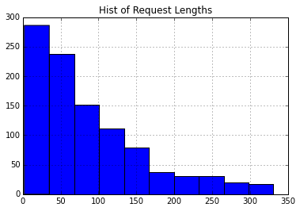
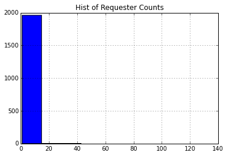
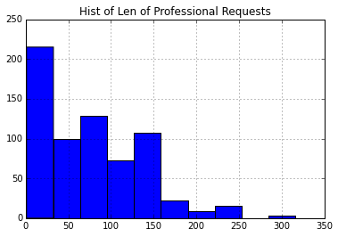
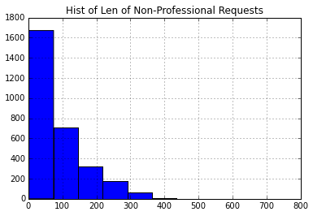

EDA for FOIA requests
---------------------

.. code:: python

    %pylab inline

.. parsed-literal::

    Populating the interactive namespace from numpy and matplotlib

.. code:: python

    # Dependencies
    import pandas
    import re
    import random
    
    from gensim import corpora, models, similarities
    from itertools import chain
    from nltk import word_tokenize, clean_html
    from nltk.corpus import stopwords
    from operator import itemgetter
Loading Data
~~~~~~~~~~~~

.. code:: python

    data = pandas.read_csv('foia_online_requests.csv',  error_bad_lines=False, encoding="ISO-8859-1")
    data = data.append(pandas.read_csv('foia_online_requests_2.csv',  error_bad_lines=False, encoding="ISO-8859-1"))
    data = data.drop_duplicates('Tracking Number')
    data = data.dropna(subset = ['Description/Basis for Appeal'])
Request Lengths
~~~~~~~~~~~~~~~

.. code:: python

    # getting lengths
    docs = [[re.sub("[^a-z]","",word) for word in document.lower().split()]
            for document in data['Description/Basis for Appeal']]
    lengths = []
    for doc in docs:
        lengths.append(len(doc))
    lengths = pandas.Series(lengths)
    
    # subsetting sample
    rows = random.sample(lengths.index, 1000)
    lengths_sample = lengths.ix[rows]
.. code:: python

    # summary stats
    lengths_sample.describe()

.. parsed-literal::

    count    1000.000000
    mean       86.359000
    std        73.981669
    min         2.000000
    25%        29.000000
    50%        65.000000
    75%       126.000000
    max       331.000000
    dtype: float64

.. code:: python

    lengths_sample.hist().set_title('Hist of Request Lengths')

.. parsed-literal::

    <matplotlib.text.Text at 0x118208b90>

It appears that requests tend to be short. The plurality are below 50
words. Question - is there a relationship between length and response?

Repeat requesters
~~~~~~~~~~~~~~~~~

.. code:: python

    # Getting the values counts of requesters
    requesters = data['Requester'].value_counts()
    requesters.head()

.. parsed-literal::

    Manuel E. Solis        139
    Kristine Savona         89
    Under Agency Review     77
    Connie Marini           53
    Greg Oberlohr           48
    dtype: int64

.. code:: python

    requesters.hist().set_title('Hist of Requester Counts')

.. parsed-literal::

    '\nprint(data[\'Requester Organization\'].describe())\nprint("\n\n\n")\nprint(data[\'Requester Organization\'].isnull().sum())\n'

.. code:: python

    # Requestor info
    print( "% of single requesters \t" +  str(float(requesters[requesters == 1].shape[0]) / float(data.shape[0]) * 100))
    print("% of requesters without org: " +  str(float(data['Requester Organization'].isnull().sum()) / float(data.shape[0]) * 100))

.. parsed-literal::

    % of single requesters 	42.8610957388
    % of requesters without org: 17.100166021

Top Words
~~~~~~~~~

.. code:: python

    words = ' '.join(data['Description/Basis for Appeal']).lower().split(' ')
    words = [re.sub("[^a-z]","",word) for word in words if word and len(word) > 3]
    words = pandas.Series(words)
    top_words = words.value_counts()
    top_words

.. parsed-literal::

                     7020
    information      3198
    request          2965
    this             2693
    that             1931
    please           1844
    environmental    1821
    site             1707
    records          1700
    would            1423
    with             1398
    your             1363
    documents        1315
    property         1142
    regarding        1141
    ...
    chapeks                    1
    sitesepa                   1
    simeon                     1
    specialistenvironmental    1
    stands                     1
    pristine                   1
    vantage                    1
    experiment                 1
    prncwe                     1
    soughtthe                  1
    espresso                   1
    tomer                      1
    facilitiesfdocuments       1
    suitablefor                1
    swrpr                      1
    Length: 17592, dtype: int64

LDA Model
~~~~~~~~~

.. code:: python

    texts = [[re.sub("[^a-z]","",word) for word in document.lower().split() if len(re.sub("[^a-z]","",word)) > 3] for document in data['Description/Basis for Appeal']]
    dictionary = corpora.Dictionary(texts)
    corpus = [dictionary.doc2bow(text) for text in texts]
.. code:: python

    tfidf = models.TfidfModel(corpus)
    corpus_tfidf = tfidf[corpus]
.. code:: python

    n_topics = 10
    lda = models.LdaModel(corpus_tfidf, id2word=dictionary, num_topics=n_topics)
    
    for i in range(0, n_topics):
        temp = lda.show_topic(i, 10)
        terms = []
        for term in temp:
            terms.append(term[1])
        print "Top 10 terms for topic #" + str(i) + ": "+ ", ".join(terms)
     

.. parsed-literal::

    WARNING:gensim.models.ldamodel:too few updates, training might not converge; consider increasing the number of passes or iterations to improve accuracy

.. parsed-literal::

    Top 10 terms for topic #0: description, agency, review, under, this, request, site, street, property, environmental
    Top 10 terms for topic #1: site, storage, environmental, property, reports, related, information, would, records, following
    Top 10 terms for topic #2: environmental, kansas, information, hazardous, records, site, property, regarding, city, have
    Top 10 terms for topic #3: site, property, landfill, environmental, troy, decree, information, waste, cleanup, with
    Top 10 terms for topic #4: detained, near, around, records, like, would, have, grant, review, environmental
    Top 10 terms for topic #5: description, agency, review, under, this, request, documents, from, copy, requesting
    Top 10 terms for topic #6: records, request, this, foia, that, documents, please, information, with, site
    Top 10 terms for topic #7: photos, fingerprint, detained, taken, around, were, review, nemours, records, have
    Top 10 terms for topic #8: responses, documents, response, supplemental, information, environmental, asbestos, version, correspondence, records
    Top 10 terms for topic #9: your, records, environmental, emissions, information, project, please, properties, need, additional

Examples of topic 9
~~~~~~~~~~~~~~~~~~~

.. code:: python

    topic_dict = {}
    for doc in range(0,1000):
        topic_number =  str(max(lda[corpus[doc]],key=itemgetter(1))[0])
        if topic_dict.get(topic_number):
            topic_dict[topic_number].append(" ".join(texts[doc]))
        else:
            topic_dict[topic_number] = [" ".join(texts[doc])]
    
    i = 0
    for doc in topic_dict["9"]:
        i += 1
        print (doc + "\n\n")
        if i > 6:
            break

.. parsed-literal::

    information regarding corps engineers case corps engineers foia ronnie alleged mechanized land clearing wetlands tract vacant land located northwest intersection sleepy hollow post road montgomery county texas property
    
    
    would like copy customs border protection background investigations report investigation regarding myself
    
    
    whom concern through freedom information requesting following listing rcra corrective action sites corracts regions would like data cdrom email would like data access excel format cannot send access excel format like file comma delimited format information would like region facility name location street address location city location state location zipcode location county number area name corrective action event code original scheduled date scheduled date actual date ncaps ranking code naics code please include documentation needed read data guarantee payment cost cost will exceed please know thank your assistance sincerely connie marini wheelers farms road milford cmariniedrnetcom
    
    
    requesting little more information about national monitoring plan pesticides
    
    
    hello through foia request requesting following region excel format listing underground storage tank site locations indian land information would like site tankid tankstatusdesc dateoftankstatuschange substancedesc overfillinstalled spillinstalled tribe locname locstr city state locphone dateinstalled thank christian ampuero christianareccheckcom
    
    
    hello through foia request requesting following region excel format listing underground storage tank site locations indian land information would like altfacilityid tribe locname latitude longitude locstr tblfacilitycity tblfacilitycounty tblfacilitystate tblfacilityzip facilitydesc tankid substancedesc tankstatusdesc tankmatdesc pipematdesc spillinstalled overfillinstalled leakdetectedorcleanclosure dateinstalled dateclosed name address tblownercity tblownercounty tblownerstate tblownerzip
    
    
    researching mine sites that will require longterm water treatment particularly those that will require treatment years into perpetuity meet water quality standards
    
    

.. code:: python

    # Getting professionals (people who have sumitted more than 10)
    professionals = data.Requester.value_counts()
    professionals = professionals[professionals > 15].index
    data.loc[data.Requester.isin(professionals), 'Professional'] = True
    # Getting length of request
    data['request_length'] = data['Description/Basis for Appeal'].apply(lambda row: len(row.split(" ")))
.. code:: python

    print(data.loc[data.Professional==True,'request_length'].describe())
    data.loc[data.Professional==True,'request_length'].hist().set_title('Hist of Len of Professional Requests')

.. parsed-literal::

    count    674.000000
    mean      75.547478
    std       59.048208
    min        1.000000
    25%       23.000000
    50%       65.000000
    75%      125.750000
    max      316.000000
    Name: request_length, dtype: float64

.. parsed-literal::

    <matplotlib.text.Text at 0x1108db050>

.. code:: python

    print(data.loc[data.Professional!=True,'request_length'].describe())
    data.loc[data.Professional!=True,'request_length'].hist().set_title('Hist of Len of Non-Professional Requests')

.. parsed-literal::

    count    2940.000000
    mean       86.681293
    std        77.036560
    min         2.000000
    25%        29.000000
    50%        62.000000
    75%       122.000000
    max       724.000000
    Name: request_length, dtype: float64

.. parsed-literal::

    <matplotlib.text.Text at 0x110964f50>

.. code:: python

    from scipy.stats import ttest_ind
    t_value, p_value = ttest_ind(data.loc[data.Professional!=True,'request_length'], data.loc[data.Professional==True,'request_length'])
    print "T-test P =", p_value

.. parsed-literal::

    T-test P = 0.000433175715683

