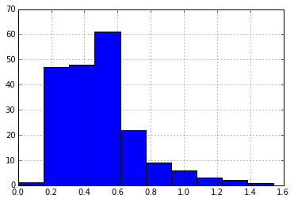
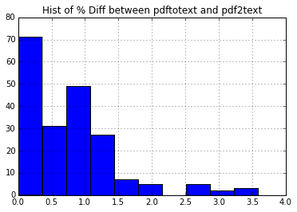
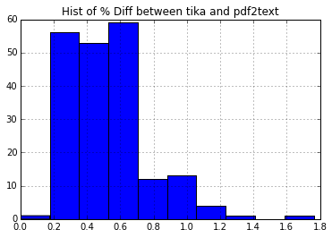
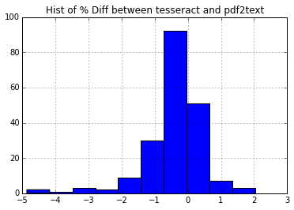

Comparing pdftotext and tika
----------------------------

Methodology:
~~~~~~~~~~~~

1. Converted 200 pdf files with pdftotext, ghostscript, pdf2text,
   pdfbox, tika, and tesseract.
2. Extracted the number of words over 3 chars in length from each
   document.
3. Created a vector containing the % difference between pdftotext and
   each of the other pdftotext converters

.. code:: python

    %pylab inline

.. parsed-literal::

    Populating the interactive namespace from numpy and matplotlib

.. code:: python

    #imports
    from glob import glob
    import numpy
    import re
    import pandas
    
    WORDS = re.compile('[A-Za-z]{3,}')
.. code:: python

    ghostscript = []
    pdf2text = []
    pdfbox = []
    pdftotext = []
    tika = []
    tess = []
    
    for d in glob("0001/DOCUMENT*"):
    
        with open(d + "/document_pdftotext.txt", 'r') as f:
            text = f.read()
            pdftotext_length = len(tuple(WORDS.finditer(text)))
            pdftotext.append(pdftotext_length)
        
        with open(d + "/document_gs_txtwrite.txt", 'r') as f:
            text = f.read()
            gs_length = len(tuple(WORDS.finditer(text)))
            ghostscript.append((gs_length - pdftotext_length) / (pdftotext_length * 1.0) * 100)
            
        with open(d + "/document_pdf2text.txt", 'r') as f:
            text = f.read()
            pdf2text_length = len(tuple(WORDS.finditer(text)))
            pdf2text.append((pdf2text_length - pdftotext_length) / (pdftotext_length * 1.0) * 100)
       
        with open(d + "/document_pdfbox.txt", 'r') as f:
            text = f.read()
            pdfbox_length = len(tuple(WORDS.finditer(text)))
            pdfbox.append((pdfbox_length - pdftotext_length) / (pdftotext_length * 1.0) * 100)
    
        with open(d + "/document_tika.txt", 'r') as f:
            text = f.read()
            tika_length = len(tuple(WORDS.finditer(text)))
            tika.append((tika_length - pdftotext_length) / (pdftotext_length * 1.0) * 100)
    
        with open(d + "/texts/document_tes.txt", 'r') as f:
            text = f.read()
            tess_length = len(tuple(WORDS.finditer(text)))
            tess.append((tess_length - pdftotext_length) / (pdftotext_length * 1.0) * 100)

.. parsed-literal::

    200
    200
    200
    200
    200

.. code:: python

    data = pandas.DataFrame({'ghostscript': ghostscript, 'pdf2text': pdf2text, 'tika': tika, 'tess': tess})
.. code:: python

    data.describe()

.. raw:: html

    

    <table border="1" class="dataframe">
      <thead>
        <tr style="text-align: right;">
          <th></th>
          <th>ghostscript</th>
          <th>pdf2text</th>
          <th>tess</th>
          <th>tika</th>
        </tr>
      </thead>
      <tbody>
        <tr>
          <th>count</th>
          <td> 200.000000</td>
          <td> 200.000000</td>
          <td> 200.000000</td>
          <td> 200.000000</td>
        </tr>
        <tr>
          <th>mean</th>
          <td> -10.894073</td>
          <td>   0.770086</td>
          <td>  -0.433613</td>
          <td>   0.525901</td>
        </tr>
        <tr>
          <th>std</th>
          <td>  27.222559</td>
          <td>   0.718852</td>
          <td>   0.878030</td>
          <td>   0.238904</td>
        </tr>
        <tr>
          <th>min</th>
          <td> -96.063492</td>
          <td>   0.000000</td>
          <td>  -4.868154</td>
          <td>   0.000000</td>
        </tr>
        <tr>
          <th>25%</th>
          <td>   0.000000</td>
          <td>   0.200044</td>
          <td>  -0.694352</td>
          <td>   0.338792</td>
        </tr>
        <tr>
          <th>50%</th>
          <td>   0.000000</td>
          <td>   0.698293</td>
          <td>  -0.325439</td>
          <td>   0.501187</td>
        </tr>
        <tr>
          <th>75%</th>
          <td>   0.000000</td>
          <td>   1.054087</td>
          <td>   0.000000</td>
          <td>   0.626959</td>
        </tr>
        <tr>
          <th>max</th>
          <td>   0.354191</td>
          <td>   3.592217</td>
          <td>   2.030457</td>
          <td>   1.762115</td>
        </tr>
      </tbody>
    </table>
    

.. code:: python

    data.ghostscript.hist().set_title("Hist of % Diff between pdftotext and ghostscript")

.. parsed-literal::

    <matplotlib.text.Text at 0x10a72b1d0>

.. code:: python

    data.pdf2text.hist().set_title("Hist of % Diff between pdftotext and pdf2text")

.. parsed-literal::

    <matplotlib.text.Text at 0x10a8857d0>

.. code:: python

    data.tika.hist().set_title("Hist of % Diff between tika and pdf2text")

.. parsed-literal::

    <matplotlib.text.Text at 0x10a9e9710>

.. code:: python

    data.tess.hist().set_title("Hist of % Diff between tesseract and pdf2text")

.. parsed-literal::

    <matplotlib.text.Text at 0x10ab44d10>

.. code:: python

    from scipy.stats import ttest_ind # Note find a better test
    t_stat, p_value = ttest_ind(data.pdf2text, data.tika)
    print("T Stats: ", t_stat)
    print("P-Value: " % p_value)

.. parsed-literal::

    ('T Stats: ', 4.5587469819775759)
    P-Value: 

