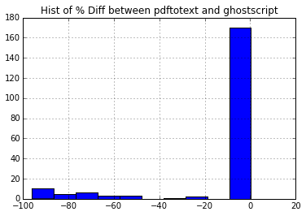

Comparing pdftotext and tika
----------------------------

Methodology:
~~~~~~~~~~~~

1. Converted 200 pdf files with both tika and pdftotext.
2. Extracted the number of words over 3 chars in length from each
   document .
3. Created a vector containing the % difference between the number of
   extracted words for each document pair.

.. code:: python

    %pylab inline

.. parsed-literal::

    Populating the interactive namespace from numpy and matplotlib

.. code:: python

    #imports
    from glob import glob
    import numpy
    import re
    import pandas
    
    WORDS = re.compile('[A-Za-z]{3,}')
.. code:: python

    
    diff = []
    for d in glob("DOCUMENT*"):
    
        with open(d + "/document.txt", 'r') as f:
            text = f.read()
            pdftotext_len = len(tuple(WORDS.finditer(text)))
    
        with open(d + "/documents_tika.txt", 'r') as f:
            text = f.read()
            tika_len = len(tuple(WORDS.finditer(text)))
    
        difference = (tika_len - pdftotext_len) / (pdftotext_len * 1.0) * 100
        diff.append(difference)
.. code:: python

    tika_perc_diff = pandas.Series(diff)
    tika_perc_diff.describe()

.. parsed-literal::

    count    200.000000
    mean       0.497971
    std        0.231230
    min        0.000000
    25%        0.313235
    50%        0.474721
    75%        0.599402
    max        1.538462
    dtype: float64

Based on these statistics it's clear that Tika extracts on average more words. There is very little probability that pdf to text would extract more words.
^^^^^^^^^^^^^^^^^^^^^^^^^^^^^^^^^^^^^^^^^^^^^^^^^^^^^^^^^^^^^^^^^^^^^^^^^^^^^^^^^^^^^^^^^^^^^^^^^^^^^^^^^^^^^^^^^^^^^^^^^^^^^^^^^^^^^^^^^^^^^^^^^^^^^^^^^^

.. code:: python

    tika_perc_diff.hist()

.. parsed-literal::

    <matplotlib.axes._subplots.AxesSubplot at 0x7fc580fb9790>

